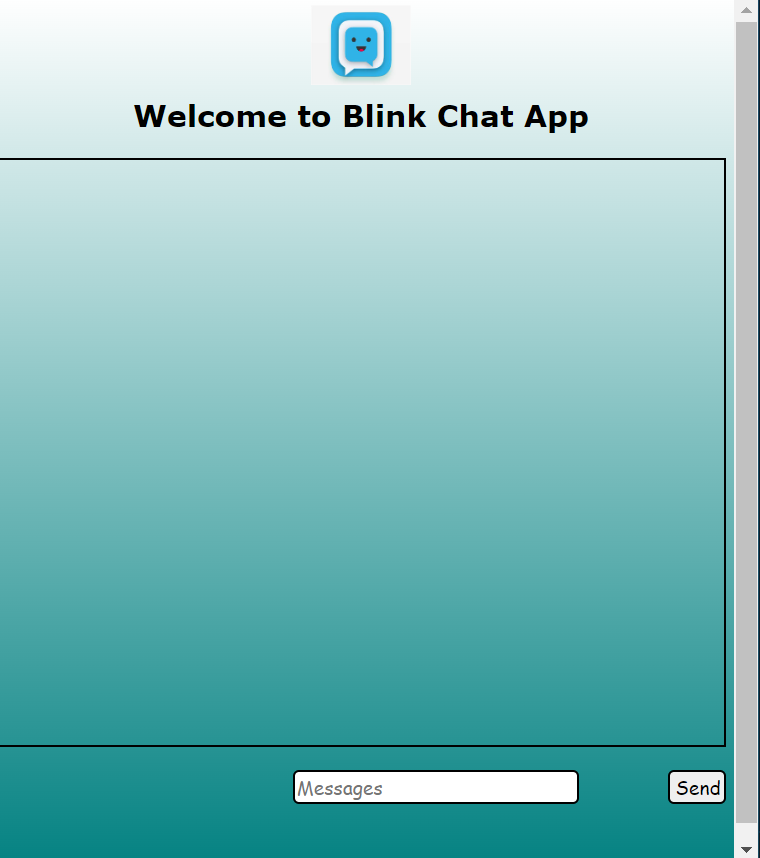

# Real-Time Chat Application Using Socket.io in Node.js


__A real-time chat application using socket.io in node.js.. Our front-end web application will look like the following:__



**This entire project is also available in my github repository. Do check it out** —

**OUR***[PROJECT_DEPLOYED HERE](https://projectchatapp.netlify.app/)*.

>TO RUN THIS FIRST OPEN A SERVER BY TYPING IN TERMINAL THIS COMMAND-
- nodemon index.js


Languages - HTML , CSS , JavaScript and Node.js.
--
---
>So, now we are ready to initiate our project. let’s dive in.

__Step 1__: First of all, open the terminal and create one directory which will be dedicated for our project. Navigate into that directory and run npm init . Then you will be asked to enter various details about your application, which will be stored as a json file named ‘Package.json’.
>Then you have to run following commands —

>npm i socket.io

>npm install -g nodemon

This will install  nodemon and socket.io modules which are the dependencies of our project.

**Nodemon** — It is a tool that helps develop node.js based applications by automatically restarting the node application when file changes in the directory are detected.

__Socket.IO__ — It enables real-time bidirectional event-based communication.

>How does ‘socket.io’ work?

The client will try to establish a WebSocket connection. WebSocket is a communication protocol which provides two-way communication between the server and the browser.

__Step 2__ — Now, we’ll create a directory named __STUDENT_PROJECT__ . Inside this directory, there will two files — index.html and style.css in css folder.
>Our index.html file will contain the following codes -


```
<!DOCTYPE html>
<html lang="en">
<head>
    <meta charset="UTF-8">
    <meta http-equiv="X-UA-Compatible" content="IE=edge">
    <meta name="viewport" content="width=device-width, initial-scale=1.0">

    <title>ichat -REALTIME NODE SOCKET.IO chat app</title>
    
    <script defer src="http://localhost:10000/socket.io/socket.io.js"></script>
    <!-- JS FILE -->
    <script defer src="./js/client.js"></script>
    <!-- link css stylesheet -->
    <link rel="stylesheet" href="./css/style.css">
    
</head>
<body>
    <nav>
        
        <h1>Welcome to Blink Chat App</h1>
    </nav>
    <!-- for all messages -->
    <div class="container">
        
    </div>

    <div class="send" >
        <form action="#" id="send-container">
            <input type="text" name="messageInp" id="messageInp" placeholder= "Messages" >
            <!-- type-when someone click it submit -->
            <button class="btn" type="submit">Send</button>
        </form>
    </div>
    
</body>
</html>
```

>Now that we have understood the function of our html file, let’s write the CSS file so that our webpage looks good. The style.css file under css folder will contain the following codes-

```
body {
    height: 100vh;
    background-image: linear-gradient(rgb(255, 255, 255), rgb(0, 128, 128));

}

.logo {
    /* do it in centre */
    display: block;
    margin: auto;
    width: 100px;
    height: 80px;
}


h1 {
    margin-top: 12px;
    font-size: 30px;
    font-family: Verdana, Geneva, Tahoma, sans-serif;
    text-align: center;
}

.container {
    max-width: 955px;
    border: 2px solid black;
    margin: auto;
    height: 60vh;
    padding: 33px;
    /* a lot of message scroll bar */
    overflow-y: auto;
    margin-bottom: 23px;
}

.message {
    /* target to all messages in container */
    background-color: white;
    width: 24%;
    padding: 10px;
    margin: 17px 3px;
    border: 2px solid black;
    border-radius: 10px;
}

/* for messages */
.left {
    float: left;
    clear: both;
}

.right {
    float: right;
    clear: both;
}

#send-container {
    display: block;
    /* margin: auto; */
    text-align: center;
    max-width: 1085px;
    width: 100%;
}

#messageInp {
    /* width: 92%;
    border: 2px solid black;
    border-radius: 6px;
    height: 34px; */
    /* float: right; */
    /* float: right; */
    /* width: 50%; */
    border: 2px solid black;
    border-radius: 6px;
    height: 34px;
    margin-left: -354px;
    display: inline-block;
    box-sizing: border-box;
    margin-right: -186px;
    font-size: larger;
    font-family: cursive;
    /* margin: auto; */
    margin: auto;
    margin-right: 3px;
    margin-left: 211px;

}

.btn {
    width: 8%;
    float: right;
    cursor: pointer;
    border: 2px solid black;
    border-radius: 6px;
    height: 34px;
    font-size: larger;
    font-family: cursive;
    /* MARGIN-RIGHT: 98px; */
}

```

__Step 3__ — In the previous step, we have finished writing codes for our front-end. Now, we’ll write codes for our back-end in index.js file.
```

// For those facing CORS issue when trying to console log the new-user-joined broadcast emit:
const io = require('socket.io')(10000, {
    cors: {
        origin: '*',
    }
});

// index.js
// node server which will handle Socket.io connection

// //const io = require('socket.io')(5000)
// usres which is connected
const users = {};

io.on('connection', socket => {
    // if any new user joins let othere user connected to the server know!
    socket.on('new-user-joined', name => {
        console.log("New user", name);
        users[socket.id] = name;
        socket.broadcast.emit('user-joined', name);

    });

    // if someone sends a message broadcast it to other people
    socket.on('send', message => {
        socket.broadcast.emit('receive', { message: message, name: users[socket.id] })
    });
    
     // if someone leaves the chat let others know
    socket.on('disconnect', message => {
        socket.broadcast.emit('left', users[socket.id])
        delete users[socket.id]
    });

})
```

Our server application will send index.html file to the client. It will receive all the events emitted by the client and will properly handle them. It will also emit events which will be received by the client for proper functioning of our web application.

__Step 4__ — So, our coding part is complete. Now, we can start our server in the terminal using the command nodemon index.js . 

__Now, we’ll open the browser and enter https://projectchatapp.netlify.app/.
 in the address bar. The webpage will prompt us for our name. We can open this page in as many windows as we want. If we send message from one window, it will be displayed in every windows. So, it is just like a real-time web-page opened in multiple clients’ browser which are connected to a common server, i.e, localhost.__

 __References:__

 https://www.npmjs.com/package/nodemon

A complete documentation for using nodemon module.

https://socket.io/

Documentation on socket.io.

---